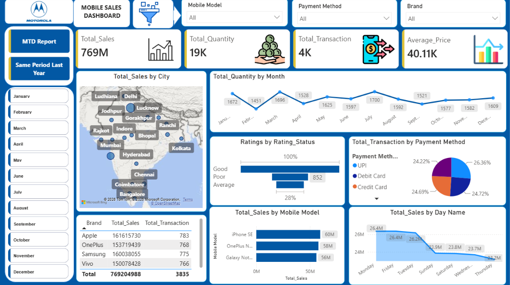
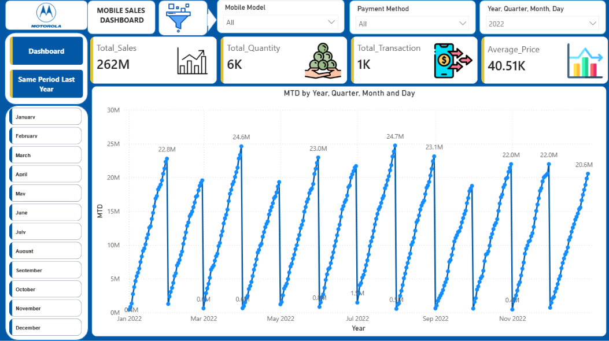
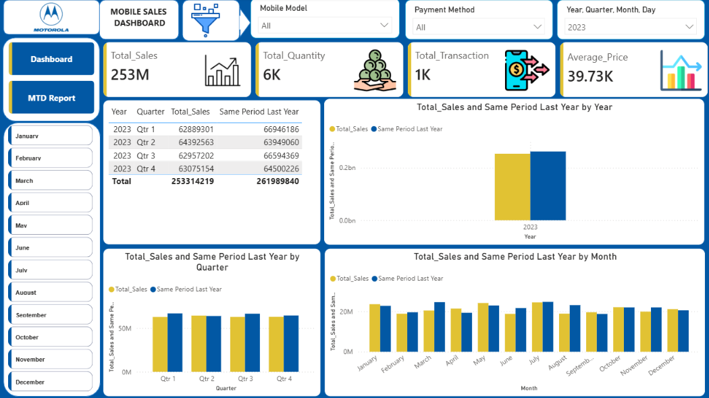

# 📱 Mobile Sales Analysis Dashboard | Power BI

An interactive Power BI dashboard designed to analyze mobile sales performance, transactions, customer ratings, and sales trends.

## 📊 Project Overview

This project focuses on analyzing mobile sales data and creating an interactive dashboard to track key business metrics and identify sales patterns.

## 🛠️ Tools & Technologies
- Power BI
- DAX
- Power Query
- Data Modeling
- Data Visualization
## 📌 Dashboard Features

- Total Sales, Quantity, Transactions & Average Price KPIs
- Sales analysis by city
- Sales performance by mobile brand and model
- Monthly quantity and sales trends
- Payment method analysis
- Customer rating analysis
- Month-to-Date (MTD) reporting
- Same Period Last Year comparison
- Year, quarter and monthly performance analysis

## 📈 Dashboard Preview

### Main Dashboard

### MTD Report

### Same Period Last Year

